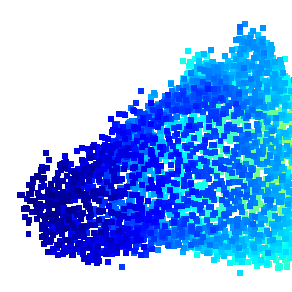

# Point Cloud Denoising via Momentum Ascent in Gradient Fields (ICIP'23)

In this repository we provide code of the paper:
> **Deep equilibrium models for video snapshot compressive imaging**
> 
> Yaping Zhao, Haitian Zheng, Zhongrui Wang, Jiebo Luo, Edmund Y. Lam
> 
> arxiv link: https://arxiv.org/abs/2202.10094

<p align="right">
  
</p>

## Installation

### Recommended Environment

The code has been tested in the following environment:

| Package                                                      | Version | Comment                                                      |
| ------------------------------------------------------------ | ------- | ------------------------------------------------------------ |
| PyTorch                                                      | 1.9.0   |                                                              |
| [point_cloud_utils](https://github.com/fwilliams/point-cloud-utils) | 0.18.0  | For evaluation only. It loads meshes to compute point-to-mesh distances. |
| [pytorch3d](https://github.com/facebookresearch/pytorch3d)   | 0.5.0   | For evaluation only. It computes point-to-mesh distances.    |
| [pytorch-cluster](https://github.com/rusty1s/pytorch_cluster) | 1.5.9   | We only use `fps` (farthest point sampling) to merge denoised patches. |

### Install via Conda (PyTorch 1.9.0 + CUDA 11.1)

```bash
conda env create -f env.yml
conda activate mag
```

### Install Manually

```bash
conda create --name mag python=3.8
conda activate mag

conda install pytorch==1.9.0 torchvision==0.10.0 cudatoolkit=11.1 -c pytorch -c nvidia

conda install -c conda-forge tqdm scipy scikit-learn pyyaml easydict tensorboard pandas

# point_cloud_utils
conda install -c conda-forge point_cloud_utils==0.18.0

# Pytorch3d
conda install -c fvcore -c iopath -c conda-forge fvcore iopath
conda install -c pytorch3d pytorch3d==0.5.0

# pytorch-scatter
conda install -c pyg pytorch-cluster==1.5.9
```

## Datasets

Download link: https://drive.google.com/drive/folders/1--MvLnP7dsBgBZiu46H0S32Y1eBa_j6P?usp=sharing

Please extract `data.zip` to `data` folder.

## Denoise

### Reproduce Paper Results

```bash
# PUNet dataset, 10K Points
python test.py --dataset PUNet --resolution 10000_poisson --noise 0.01 --niters 1
python test.py --dataset PUNet --resolution 10000_poisson --noise 0.02 --niters 1
python test.py --dataset PUNet --resolution 10000_poisson --noise 0.03 --niters 2
# PUNet dataset, 50K Points
python test.py --dataset PUNet --resolution 50000_poisson --noise 0.01 --niters 1
python test.py --dataset PUNet --resolution 50000_poisson --noise 0.02 --niters 1
python test.py --dataset PUNet --resolution 50000_poisson --noise 0.03 --niters 2
```

### Denoise Regular-Size Point Clouds (≤ 50K Points)

```bash
python test_single.py --input_xyz <input_xyz_path> --output_xyz <output_xyz_path>
```

You may also barely run `python test_single.py` to see a quick example.

### Denoise Large Point Clouds (> 50K Points)

```bash
python test_large.py --input_xyz <input_xyz_path> --output_xyz <output_xyz_path>
```

You may also barely run `python test_large.py` to see a quick example.

## Train

```bash
python train.py
```

Please find tunable parameters in the script.


# Citation
Cite our paper if you find it interesting!
```
@article{zhao2022point,
  title={Point Cloud Denoising via Momentum Ascent in Gradient Fields},
  author={Zhao, Yaping and Zheng, Haitian and Wang, Zhongrui and Luo, Jiebo and Lam, Edmund Y},
  journal={arXiv preprint arXiv:2202.10094},
  year={2022}
}
```

This code is implemented based on [Score](https://github.com/luost26/score-denoise).